[yash0.in](https://yash0.in/) &nbsp;·&nbsp;
[github](https://github.com/YashasVM)

> 18-year-old tech enthusiast from ಬೆಂಗಳೂರು, ಕರ್ನಾಟಕ (Bengaluru, Karnataka). 
> Burdened with glorious purpose.

Self-hosting advocate who loves breaking things, only to fix them again. 
A homelab full of containers, tunnels and dashboards, and a soft spot for 
Android apps, terminal UIs and anything that runs free on Cloudflare.

<samp>kotlin &nbsp; typescript &nbsp; rust &nbsp; python &nbsp; react &nbsp; fastapi &nbsp; docker &nbsp; cloudflare &nbsp; linux &nbsp; git</samp>

**[OpenStream](https://github.com/YashasVM/OpenStream)** &nbsp;·&nbsp; <samp>kotlin</samp> 
Turn any Android phone into a wireless camera source for OBS Studio.

**[Kernel-browser](https://github.com/YashasVM/Kernel-browser)** &nbsp;·&nbsp; <samp>kotlin, geckoview</samp> 
A Safari-inspired Android browser with native UI, private tabs, 
tab previews and bundled extensions.

**[HOLEN](https://github.com/YashasVM/HOLEN)** &nbsp;·&nbsp; <samp>react, fastapi, docker</samp> 
Private, self-hosted YouTube downloader built on yt-dlp and ffmpeg.

**[yt-cmd](https://github.com/YashasVM/yt-cmd)** &nbsp;·&nbsp; <samp>tui</samp> 
A fast terminal UI for YouTube downloads with smart presets and 4K support.

**[cd](https://github.com/YashasVM/cd)** &nbsp;·&nbsp; <samp>webrtc</samp> 
Modernized fork of Sha: clearer UI, cleaner code, faster WebRTC file transfers.

Every graphic here is generated, not embedded from anyone else's server. 
`dino.svg` is a T. rex pushed through a character ramp by 
[`scripts/make_portrait.py`](scripts/make_portrait.py); the stat graphics and 
section headings are drawn by [a scheduled action](.github/workflows/stats.yml) 
straight from the GitHub GraphQL API, once a day.

Design and scripts adapted from [andriidrok1](https://github.com/andriidrok1/andriidrok1).
T. rex art by [myfavoritedinosaur.com and LadyofHats](https://commons.wikimedia.org/wiki/File:Tyrannosaurus_Rex_colored.png), CC BY 3.0.
Typeface: [JetBrains Mono](scripts/fonts).
